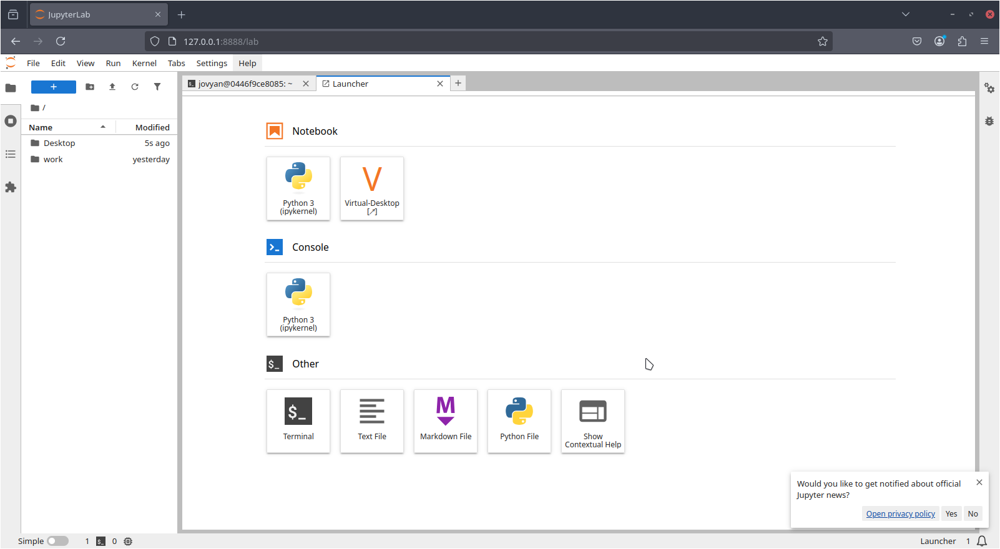
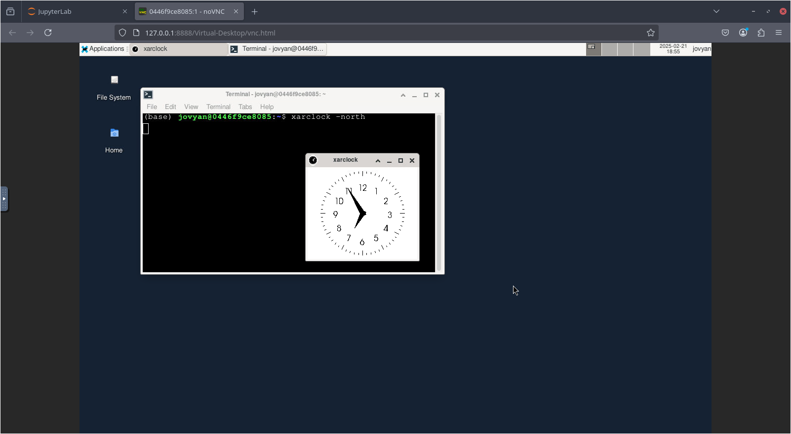
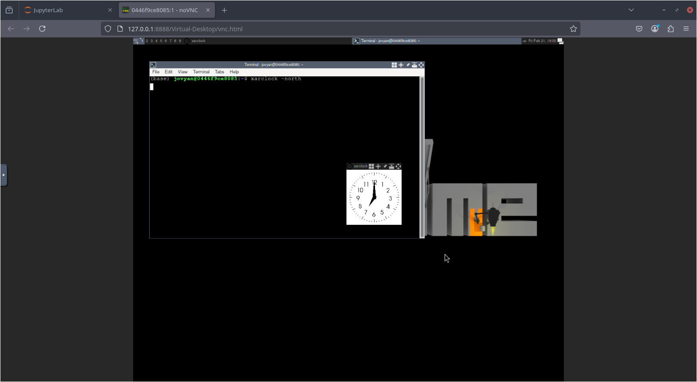
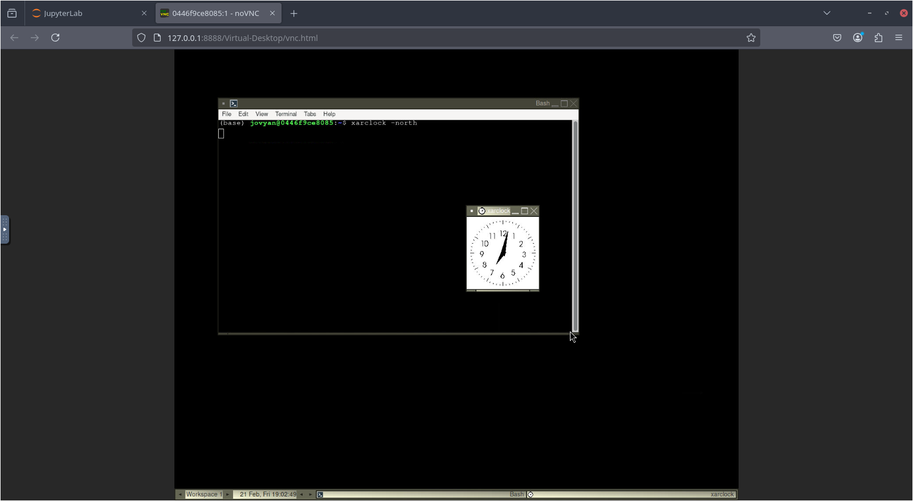

# Jupyter with VNC

Yet another JupyterLab with an integrated VNC server/client solution.

Uses [jupyter-server-proxy](https://github.com/jupyterhub/jupyter-server-proxy)
to allow connecting to the VNC client without opening additional ports.

# Usage

Make sure you have docker [installed](https://docs.docker.com/engine/install/).

Build this image with:

`docker build --tag jvnc .`

Once complete, you can create a container with:

`docker run -p 8888:8888 -e START_XVFB_AND_VNC=1 -e DESKTOP_ENVIRONMENT=xfce jvnc`

Access the JupyterLab using the link supplied to you in the terminal output. You
can then use the "Virtual-Desktop" card in the Launcher menu to access the
virtual desktop.

---

Additional arguments for the `DESKTOP_ENVIRONMENT` variable are `fluxbox` and
`awesome`, with `xfce` being the default.

The `START_XVFB_AND_VNC` isn't strictly necessary, but useful if you don't want
to start the X server and VNC server "by hand".

If you choose not to include this variable, you must run the following in a
JupyterLab terminal:

`xinit -- /usr/bin/Xvfb :1`

# Images

